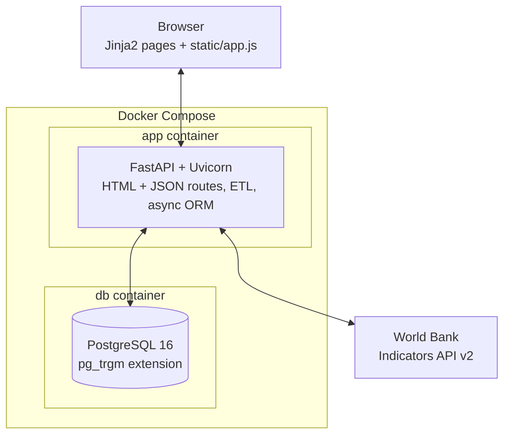

# World Bank Data Browser

A web application for browsing, downloading, and querying data from the [World Bank Indicators API](https://datahelpdesk.worldbank.org/knowledgebase/articles/889392-about-the-indicators-api-documentation). It syncs the World Bank catalogue into a local PostgreSQL database and serves a dashboard UI for exploring sources, indicators, countries, and time-series data.

## Tech Stack

- **Backend:** Python 3.12, FastAPI, SQLAlchemy (async), Alembic
- **Database:** PostgreSQL 16 (with `pg_trgm` for fuzzy search)
- **ETL:** httpx + tenacity for resilient World Bank API fetching
- **Frontend:** Server-side Jinja2 templates with dark mode support
- **Infrastructure:** Docker Compose, GitHub Actions CI

## Architecture



The browser talks to the FastAPI app for both the server-rendered dashboard and its JSON endpoints. The app reads and writes PostgreSQL through an async SQLAlchemy ORM, and its ETL layer (`wb_client.py`, `catalog_sync.py`, `download_manager.py`) pulls catalogue and indicator data from the World Bank API in the background. The app and database run as two services under Docker Compose, with Alembic migrations applied automatically on container startup.

## Prerequisites

- [Docker](https://docs.docker.com/get-docker/) and Docker Compose

That's it — no local Python, PostgreSQL, or other dependencies needed.

## Getting Started

### 1. Clone the repo

```bash
git clone https://github.com/carlosyv/wb_data_app.git
cd wb_data_app
```

### 2. Set up environment variables

```bash
cp .env.example .env
```

Edit `.env` if you want to change the default database credentials or port. The defaults work out of the box.

### 3. Start the app

```bash
docker compose up -d --build
```

This will:

1. Start a PostgreSQL 16 database with the `pg_trgm` extension
2. Build the Python application image
3. Wait for the database to be healthy
4. Run Alembic migrations automatically
5. Start the FastAPI server

The app will be available at **[http://localhost:9000](http://localhost:9000)**. On first startup, it automatically syncs the World Bank catalogue (this may take a minute).

### Useful commands

```bash
# View logs
docker compose logs -f app

# Stop everything
docker compose down

# Stop and remove database volume (full reset)
docker compose down -v

# Rebuild after code changes
docker compose up -d --build
```

## Project Structure

```
wb_data_app/
├── src/
│   ├── main.py            # FastAPI app entry point & lifespan
│   ├── api/               # Route handlers (pages, sources, indicators, etc.)
│   ├── config/            # Pydantic settings loaded from .env
│   ├── db/
│   │   ├── engine.py      # Async SQLAlchemy engine & session factory
│   │   ├── models.py      # ORM models (sources, countries, indicators, data points)
│   │   └── migrations/    # Alembic migration scripts
│   ├── etl/               # World Bank API client, catalogue sync, download manager
│   └── utils/             # Shared helpers (data_reader)
├── templates/             # Jinja2 HTML templates (dashboard, browse, download, etc.)
├── static/                # Client-side JavaScript
├── tests/                 # Test suite
├── docker/
│   ├── Dockerfile         # Multi-stage build (production + test)
│   ├── entrypoint.sh      # Waits for DB, runs migrations, starts server
│   └── init-extensions.sql
├── docker-compose.yml     # Orchestrates app + database
├── .github/workflows/     # CI pipeline (lint + test via Docker)
├── .env.example           # Template for environment variables
├── alembic.ini            # Alembic configuration
└── requirements.txt       # Python dependencies
```

## Environment Variables

| Variable | Description | Default |
|---|---|---|
| `DB_HOST` | PostgreSQL host (set to `db` by Docker Compose) | `localhost` |
| `DB_PORT` | PostgreSQL port | `5432` |
| `DB_NAME` | Database name | `wb_web_app` |
| `DB_USER` | Database user | `user` |
| `DB_PASSWORD` | Database password | `changeme` |
| `WB_API_BASE_URL` | World Bank API base URL | `https://api.worldbank.org/v2` |
| `APP_ENV` | Environment (development/production) | `development` |
| `APP_PORT` | Application port | `9000` |
| `APP_DEBUG` | Enable debug mode | `true` |

## Running Tests

Tests run inside Docker, matching the production environment:

```bash
docker build --target test -t wb-data-app:test -f docker/Dockerfile .
docker compose up -d
docker compose exec app pip install pytest pytest-cov pytest-asyncio
docker compose exec app pytest tests/ -v
```

## License

TBD
